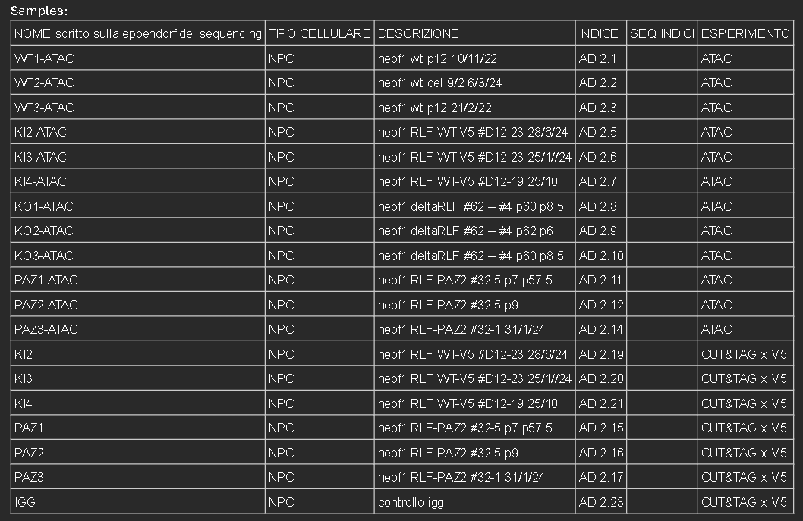

# ATAC-seq Analysis Pipeline

This Snakemake pipeline processes ATAC-seq data and performs differential analysis between experimental conditions.

## Steps

1. build *hg38* bowtie2_index -> `/data/hg38.fa` -> `crate_reference.sh` -> `/bowtie2_index`
   - or use brebuild -> `/bowtie2_index_prbuild`

2. get TSS data -> `/resources` -> `get_tss_from_genecode.sh` -> `gencode_tss.bed`

3. `run.sh` -> run Snakefile

4. `/post_analysis`

## Directory Structure

```
.
├── config.yaml           # Configuration file
├── Snakefile            # Pipeline rules
├── scripts/
│   └── run_diffbind.R   # R script for differential analysis
└── results/             # Output directory (created during execution)
    ├── qc/              # Quality control results
    ├── trimmed/         # Trimmed fastq files
    ├── bam/             # Aligned and processed BAM files
    ├── peaks/           # MACS2 peak calls
    └── diffbind/        # Differential binding results
```

## Configuration

1. Edit `config.yaml` to specify:
   - Sample information
   - Reference genome paths
   - Tool parameters
   - Differential analysis comparisons

2. Required reference files:
   - Genome FASTA file
   - Bowtie2 index
   - Blacklist regions (BED format)

## Usage

1. Activate the conda environment:
```bash
conda activate snakemake
```

2. Run the pipeline:
```bash
snakemake --use-conda -j <number_of_cores>
```

## Pipeline Steps

1. Quality Control
   - FastQC on raw reads

2. Read Processing
   - Adapter trimming (Trimmomatic)
   - Quality filtering

3. Alignment
   - Bowtie2 alignment
   - BAM sorting
   - Duplicate marking
   - Filtering (mapping quality, blacklist regions)

4. Peak Calling
   - MACS2 narrow peak calling

5. Differential Analysis
   - DiffBind analysis between conditions
   - Results filtered by FDR and fold change

## Output

- `results/qc/fastqc/`: FastQC HTML reports
- `results/bam/`: Processed BAM files
- `results/peaks/`: MACS2 peak files
- `results/diffbind/`: Differential binding results (CSV files)

## Notes

- Results are filtered based on FDR and fold change thresholds specified in config.yaml 